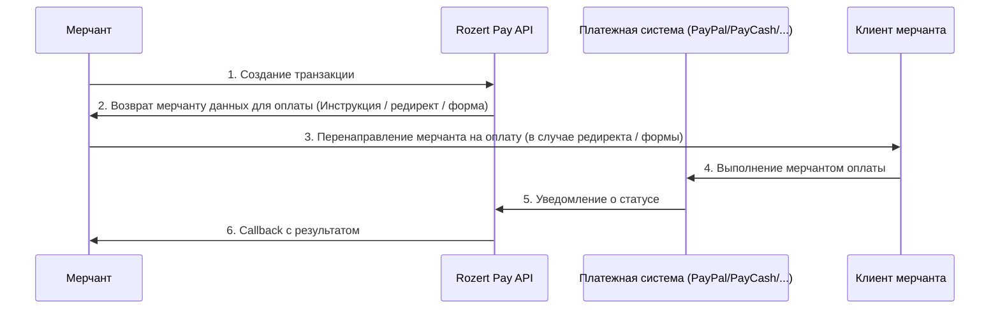

# Rozert Pay API Documentation

## Обзор

### %%link api-docs АПИ документация%%

Rozert Pay - это платежный API, который позволяет мерчантам интегрировать различные платежные методы в свои
приложения. API поддерживает депозиты и выводы средств через различные платежные системы.

Доступные платежные системы:

* %%link api.paypal Paypal%%
* %%link api.paycash PayCash%%
* %%link api.appex Appex%%

## Базовый флоу взаимодействия



### 1. Создание транзакции

Мерчант создает транзакцию, указывая:
- Тип транзакции (депозит/вывод)
- Сумму и валюту
- ID кошелька
- Данные пользователя (для PayPal)
- URL для перенаправления после оплаты
- URL для получения уведомлений о статусе

### 2. Возврат мерчанту данных для оплаты

В зависимости от платежной системы, API возвращает:

- Данные формы для перенаправления пользователя. %%link transaction.response См. поле form%%.
  Например так работает Paypal
- Инструкции для оплаты (например PayCash). %%link transaction.response См поле instruction%%.
- Информацию о созданной транзакции

### 3. Callback уведомления

Rozert Pay отправляет уведомления о статусе транзакции на указанный callback URL. Основные статусы:
- `pending` - Транзакция в процессе
- `success` - Транзакция успешно завершена
- `failed` - Транзакция отклонена
- `refunded` - Транзакция возвращена

## Основные компоненты API

### %%link api-docs АПИ документация%%

### Аутентификация

API использует HMAC-аутентификацию для защиты запросов. Для каждого запроса необходимо передавать следующие заголовки:
- `X-Merchant-Id` - ID мерчанта
- `X-Signature` - HMAC подпись запроса

Пример HMAC подписи:

```python
%%snippet doc.signature%%
```

Пример хидеров подписаного запроса:

```python
%%snippet authorization.request.example%%
```


## [Python client](https://github.com/nvnv/rozert-python-client/blob/main/rozert_client.py)

Для python3.12 доступен клиент для работы с Rozert Pay API.
См. rozert_client.py и examples.py

Пример инициализации клиента:

```python
%%snippet rozert_client.init%%
```

Пример создания депозитной транзакции для PayPal:

```python
%%snippet rozert_client.deposit.paypal%%
```


Пример создания депозитной транзакции для Paycash:

```python
%%snippet rozert_client.deposit.paycash%%
```


## Sandbox режим

В sandbox режиме все транзакции автоматически переходят в успех через некоторый промежуток времени.
Для sandbox режима требуются отдельные ключи, и нужно передавать в запросах `X-Sandbox-Mode: true`.
При использовании python клиента нужно передать `sandbox=True` при инициализации.
